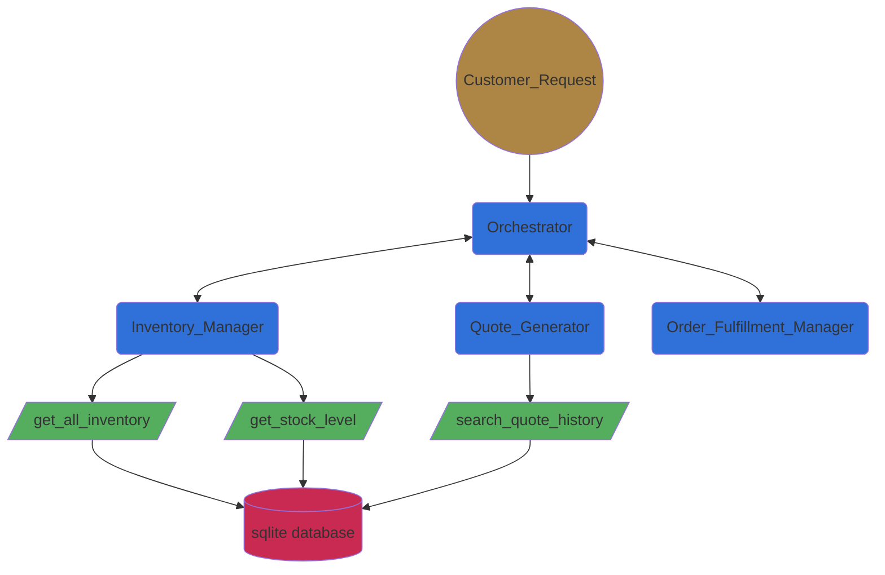

```mermaid
flowchart TD
    %% ======= Class definitions ======
    classDef customerRequest fill:#ad8544
    classDef agent fill:#3070d9
    classDef function fill:#55ad5e
    classDef database fill:#c92a52

    %% ======= Nodes =========
    CR((Customer_Request)):::customerRequest
    OR(Orchestrator):::agent
    IM(Inventory_Manager):::agent
    QG(Quote_Generator):::agent
    OFM(Order_Fulfillment_Manager):::agent
    Func_1[/get_all_inventory/]:::function
    Func_2[/get_stock_level/]:::function
    Func_3[/search_quote_history/]:::function
    DB[(sqlite database)]:::database

    %% ======= Edges =========
    CR --> OR
    OR <--> IM
    OR <--> QG
    OR <--> OFM
    IM --> Func_1
    IM --> Func_2
    QG --> Func_3
    Func_1 --> DB
    Func_2 --> DB
    Func_3 --> DB


```
